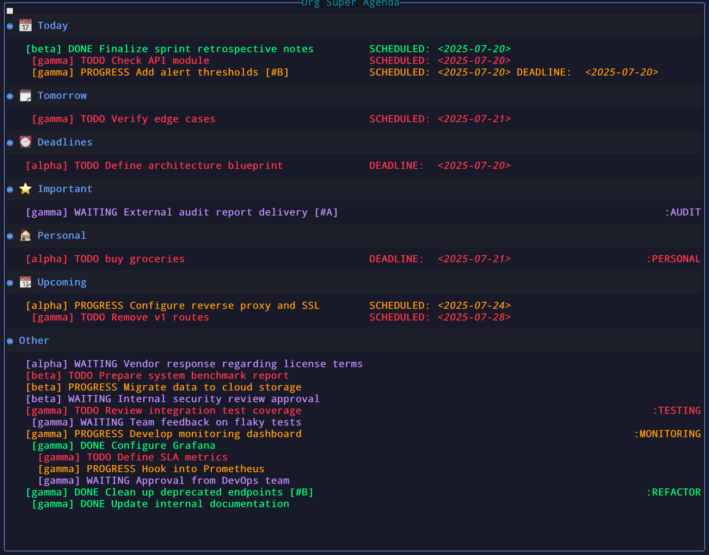

# org-super-agenda.nvim



A Neovim plugin inspired by [org-super-agenda](https://github.com/alphapapa/org-super-agenda) for Emacs. This plugin allows you to organize your org-mode agenda items into custom groups based on various criteria.

## ✨ Features

- One command: `:OrgSuperAgenda`, no buffers polluted  
- Simple and clean interface  
- Smart groups: Today, Overdue, Upcoming … fully user‑defined  
  - Group org items by priority, tags, scheduled dates, deadlines, etc.  
- Per‑state colors & strike‑through; highlight just the parts you care about  
- Quick filtering by TODO state with per-state keymaps (press `oa` to show all)
- Change the SCHEDULED date with `cs` or set a DEADLINE with `cd`
- Press `<CR>` on an agenda item to view its source headline in the same floating window and return to the agenda when that file is closed  
- Customize the order of filename, dates, TODO keywords and other parts of each heading  

## 📦 Installation and configuration

Using lazy.nvim:

```lua
return {
  'hamidi-dev/org-super-agenda.nvim',
  dependencies = {
    'nvim-orgmode/orgmode', -- required
    {
      'lukas-reineke/headlines.nvim', -- optional nicety
      config = true
    }
  },
  config = function()
    require("org-super-agenda").setup({
      org_directories     = {}, -- recurse for *.org
      todo_states         = {
        {
          name           = 'TODO',
          keymap         = 'ot',
          color          = '#FF5555',
          strike_through = false,
          fields         = { 'filename', 'todo', 'headline', 'priority', 'date', 'tags' },
        },
        {
          name           = 'PROGRESS',
          keymap         = 'op',
          color          = '#FFAA00',
          strike_through = false,
          fields         = { 'filename', 'todo', 'headline', 'priority', 'date', 'tags' },
        },
        {
          name           = 'WAITING',
          keymap         = 'ow',
          color          = '#BD93F9',
          strike_through = false,
          fields         = { 'filename', 'todo', 'headline', 'priority', 'date', 'tags' },
        },
        {
          name           = 'DONE',
          keymap         = 'od',
          color          = '#50FA7B',
          strike_through = true,
          fields         = { 'filename', 'todo', 'headline', 'priority', 'date', 'tags' },
        },
      },
      keymaps = {
        filter_reset = 'oa',
        reschedule   = 'cs',
        set_deadline = 'cd',
      },
      window           = {
        width        = 0.8,
        height       = 0.7,
        border       = "rounded",
        title        = 'Super Agenda',
        title_pos    = 'center',
        margin_left  = 0,  -- increasing this breaks stuff for now, so use with care
        margin_right = 0,  -- increasing this is fine
      },
      -- NOTE: group specification. Order matters!. First matcher wins!
      groups              = {
        { name = "📅 Today", matcher = function(i) return i.scheduled and i.scheduled:is_today() end },
        { name = "🗓️ Tomorrow", matcher = function(i) return i.scheduled and i.scheduled:days_from_today() == 1 end, },
        {
          name = "⏰ Deadlines",
          matcher = function(i)
            return i.deadline ~= nil and i.todo_state ~= 'DONE' and
                not i:has_tag("personal")
          end,
        },
        {
          name = "⭐ Important",
          matcher = function(i)
            return i.priority == "A" and
                (i.deadline ~= nil or i.scheduled ~= nil)
          end
        },
        {
          name = '⏳ Overdue',
          matcher = function(it)
            return it.todo_state ~= 'DONE' and (
              (it.deadline and it.deadline:is_past()) or
              (it.scheduled and it.scheduled:is_past())
            )
          end
        },
        { name = "🏠 Personal", matcher = function(item) return item:has_tag("personal") end },
        { name = "💼 Work", matcher = function(item) return item:has_tag("work") end },
        {
          name = "📆 Upcoming",
          matcher = function(it)
            local days = require('org-super-agenda.config').get().upcoming_days or 10
            local deadline_ok = it.deadline and it.deadline:days_from_today() >= 0 and
                it.deadline:days_from_today() <= days
            local sched_ok = it.scheduled and it.scheduled:days_from_today() >= 0 and
                it.scheduled:days_from_today() <= days
            return deadline_ok or sched_ok
          end
        },
      },
      ---------------------------------------------------------------------------
      -- misc
      hide_empty_groups   = false,   -- set true to drop blank sections
      keep_order          = false,   -- keep original org‑agenda sort
      allow_unsafe_groups = true,    -- for :pred / :auto-map later
      group_format        = '* %s',  -- header text for groups
      other_group_name    = 'Other', -- title for catchall group
      show_other_group    = false,   -- disable to remove catchall group
      show_tags           = true,    -- display headline tags aligned right
      inline_dates        = true,    -- show SCHEDULED/DEADLINE info before TODO
      short_date_labels   = false,   -- use 'S'/'D' instead of full labels
      show_filename       = true,    -- append the source file name to headings
      heading_order       = { 'filename', 'todo', 'headline', 'priority', 'date' },
      heading_max_length  = 70,      -- truncate headings after this many characters
      upcoming_days       = 10,
    })
  end
}
```

## 🧠 Custom Groups with Lua

Define your own agenda groups using Lua matchers — full control, no DSL required.

```lua
groups = {
  {
    name = "🔥 Urgent Work",
    matcher = function(item)
      return item:has_tag("work") and item.priority == "A"
    end,
  },
  {
    name = "💤 Someday",
    matcher = function(item)
      return item:has_tag("someday") or item.todo_state == "WAITING"
    end,
  },
  {
    name = "🧪 Experimental",
    matcher = function(item)
      return item.headline:match("Proof of Concept") or item:has_tag("test")
    end,
  },
}
```

You can match based on:

- `item.todo_state` — e.g. `'TODO'`, `'DONE'`, etc.
- `item.headline` — the full text of the headline
- `item:has_tag("tagname")` — tag checking
- `item.priority` — `'A'`, `'B'`, `'C'` or `nil`
- `item.scheduled`, `item.deadline` — both support methods like `:is_today()` or `:days_from_today()`

💡 *Note:* Groups are checked in order. The **first match wins**!

## 🤝 Contributing

Found a bug? Have a feature request? Feel free to:

1. Submit a pull request  
2. Open an issue  
3. Start a discussion  

All contributions are welcome! 🎉

## 📄 License

MIT License

